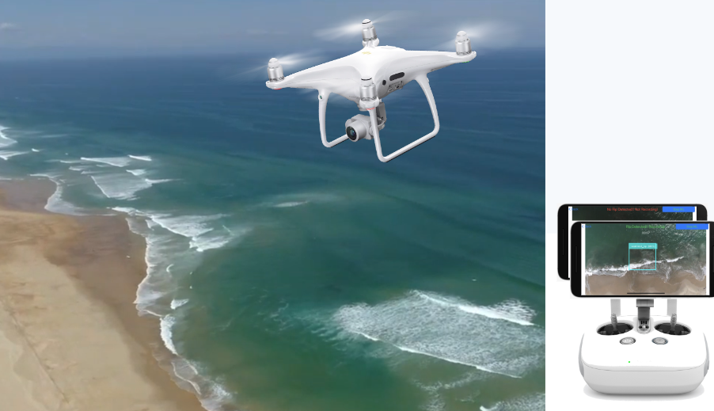

# RipScout

## Overview  
Welcome to RipScout, the cutting-edge solution for real-time rip current detection and data collection. Utilizing advanced drones equipped with machine learning (ML) technology, RipScout operates independently of an Internet connection, harnessing lightweight ML models optimized for drone controllers' limited computing resources. Our system stands out for its ability to swiftly detect rip currents, hover precisely over the detected area, and collect comprehensive video data from various angles and elevations. 

Designed for ease of use, RipScout empowers even those unfamiliar with rip currents to effectively gather critical data. Field tests confirm that RipScout dramatically enhances data collection speed and accuracy, offering a novel rip current dataset that promises significant advancements in coastal monitoring and safety. With RipScout, we're redefining coastal surveillance and contributing to safer, more informed marine environments.

This repository builds upon the foundational work of [DJI iOS FPV Demo](https://github.com/DJI-Mobile-SDK-Tutorials/iOS-FPVDemo) and [TensorFlow Lite Object Detection](https://github.com/tensorflow/examples/tree/master/lite/examples/object_detection/ios).  



### Key Features  
- **DJI Drone Integration**: Utilize DJI drones for autonomous and manual flights.  
- **Real-time Object Detection**: AI-powered detection using TensorFlow Lite.  
- **Swift & iOS Frameworks**: Developed in Swift with a focus on performance and efficiency. 

## Installation & Setup  
### Prerequisites  
- macOS with Xcode installed.  
- CocoaPods for dependency management.  
- DJI SDK development account.  

### Steps  
1. Clone this repository:  
   ```sh
   git clone https://github.com/fahimhkhan/DroneML-Swift.git
   cd DroneML-Swift

2. Install dependencies:
   ```sh
    pod install

3. Open the project using Xcode:
   ```sh
    open DroneML-Swift.xcworkspace
4. Register your app with the DJI Developer Portal and configure the necessary API keys.


### Usage
Launch the app on a connected iOS device.
Connect your DJI drone.
Start object detection using the AI model.

### Disclaimer
The RipScout application software was developed using the DJI Mobile SDK to be compatible with all DJI drones and was tested specifically on the DJI Phantom 4 Pro v2. However, as this software is a prototype, improper use may result in damage or loss of your Drone/UAV.

THE SOFTWARE IS PROVIDED "AS IS", WITHOUT WARRANTY OF ANY KIND, EXPRESS OR IMPLIED, INCLUDING BUT NOT LIMITED TO THE WARRANTIES OF MERCHANTABILITY, FITNESS FOR A PARTICULAR PURPOSE AND NONINFRINGEMENT. IN NO EVENT SHALL THE AUTHORS OR COPYRIGHT HOLDERS BE LIABLE FOR ANY CLAIM, DAMAGES OR OTHER LIABILITY, WHETHER IN AN ACTION OF CONTRACT, TORT OR OTHERWISE, ARISING FROM, OUT OF OR IN CONNECTION WITH THE SOFTWARE OR THE USE OR OTHER DEALINGS IN THE SOFTWARE.

### Acknowledgments
This project is based on:

[DJI iOS FPV Demo](https://github.com/DJI-Mobile-SDK-Tutorials/iOS-FPVDemo)
[TensorFlow Lite Object Detection for iOS](https://github.com/tensorflow/examples/tree/master/lite/examples/object_detection/ios)

## Publication

If you use any part of this code and dataset, please cite the following paper:

**Text Citation:**

F. H. Khan *et al.*, "RipScout: Realtime ML-Assisted Rip Current Detection and Automated Data Collection Using UAVs," in *IEEE Journal of Selected Topics in Applied Earth Observations and Remote Sensing*, vol. 18, pp. 7742–7755, 2025, doi: [10.1109/JSTARS.2025.3543695](https://doi.org/10.1109/JSTARS.2025.3543695).

**BibTeX Citation:**

```bibtex
@ARTICLE{10892036,
  author={Khan, Fahim Hasan and Stewart, Donald and de Silva, Akila and Palinkas, Ashleigh and Dusek, Gregory and Davis, James and Pang, Alex},
  journal={IEEE Journal of Selected Topics in Applied Earth Observations and Remote Sensing}, 
  title={RipScout: Realtime ML-Assisted Rip Current Detection and Automated Data Collection Using UAVs}, 
  year={2025},
  volume={18},
  number={},
  pages={7742-7755},
  keywords={Drones;Accuracy;Computational modeling;Data collection;Graphics processing units;Cameras;Visualization;Convolutional neural networks;Systems architecture;Servers;Computer vision;data collection;machine learning (ML);mobile computing;real-time processing;rip current detection;uncrewed aerial vehicle (UAVs)},
  doi={10.1109/JSTARS.2025.3543695}
}
```

Disclaimer: Please note that the current version of the code and dataset may not precisely correspond to the implementation described in the published paper, as ongoing updates and improvements are made periodically.

### Dataset

The dataset for training ML models are available in two formats in the following links:

For training SSD-Mobilenet and EfficientDet family of models

[Pascal VOC](https://drive.google.com/drive/folders/1kFFPlb7CrV92dAoml5-obwEiuj0cZjd-?usp=sharing)

For training YOLOv8 family of models

[YOLOv8](https://drive.google.com/drive/folders/1QvsKMcFN8XX_oreh5z7aT3dczchjaWrH?usp=sharing)

### Contributing
Contributions are welcome! Feel free contact us at fkhan19@calpoly.edu

### License
**UC Santa Cruz Noncommercial License**

Acceptance

In order to get any license under these terms, you must agree to them as both strict obligations and conditions to all your licenses.

Copyright License

The licensor grants you a copyright license for the software to do everything you might do with the software that would otherwise infringe the licensor's copyright in it for any permitted purpose. However, you may only distribute the software according to Distribution License and make changes or new works based on the software according to Changes and New Works License.

Distribution License

The licensor grants you an additional copyright license to distribute copies of the software. Your license to distribute covers distributing the software with changes and new works permitted by Changes and New Works License.

Notices

You must ensure that anyone who gets a copy of any part of the software from you also gets a copy of these terms, as well as the following copyright notice:

This software is Copyright ©2025. The Regents of the University of California (“Regents”). All Rights Reserved.

Changes and New Works License

The licensor grants you an additional copyright license to make changes and new works based on the software for any permitted purpose.

Noncommercial Purposes

Any noncommercial purpose is a permitted purpose.

Commercial Purposes

Contact Innovation Transfer, UC Santa Cruz, innovation@ucsc.edu , https://officeofresearch.ucsc.edu/iatc/ , for any commercial purpose.

Personal Uses

Personal use for research, experiment, and testing for the benefit of public knowledge, personal study, private entertainment, hobby projects, amateur pursuits, or religious observance, without any anticipated commercial application, is use for a permitted purpose.

Noncommercial Organizations

Use by any charitable organization, educational institution, public research organization, public safety or health organization, environmental protection organization, or government institution is use for a permitted purpose regardless of the source of funding or obligations resulting from the funding.

Fair Use

You may have "fair use" rights for the software under the law. These terms do not limit them.

No Other Rights

These terms do not allow you to sublicense or transfer any of your licenses to anyone else, or prevent the licensor from granting licenses to anyone else.  These terms do not imply any other licenses.

Patent Defense

If you make any written claim that the software infringes or contributes to infringement of any patent, all your licenses for the software granted under these terms end immediately. If your company makes such a claim, all your licenses end immediately for work on behalf of your company.

Violations

The first time you are notified in writing that you have violated any of these terms, or done anything with the software not covered by your licenses, your licenses can nonetheless continue if you come into full compliance with these terms, and take practical steps to correct past violations, within 32 days of receiving notice.  Otherwise, all your licenses end immediately.

No Liability

As far as the law allows, the software comes as is, without any warranty or condition, and the licensor will not be liable to you for any damages arising out of these terms or the use or nature of the software, under any kind of legal claim.

Definitions

The "licensor" is Regents, and the "software" is the software the licensor makes available under these terms.

"You" refers to the individual or entity agreeing to these terms.

"Your company" is any legal entity, sole proprietorship, or other kind of organization that you work for, plus all organizations that have control over, are under the control of, or are under common control with that organization.  

"Control" means ownership of substantially all the assets of an entity, or the power to direct its management and policies by vote, contract, or otherwise.  Control can be direct or indirect.

"Your licenses" are all the licenses granted to you for the software under these terms.

"Use" means anything you do with the software requiring one of your licenses.
